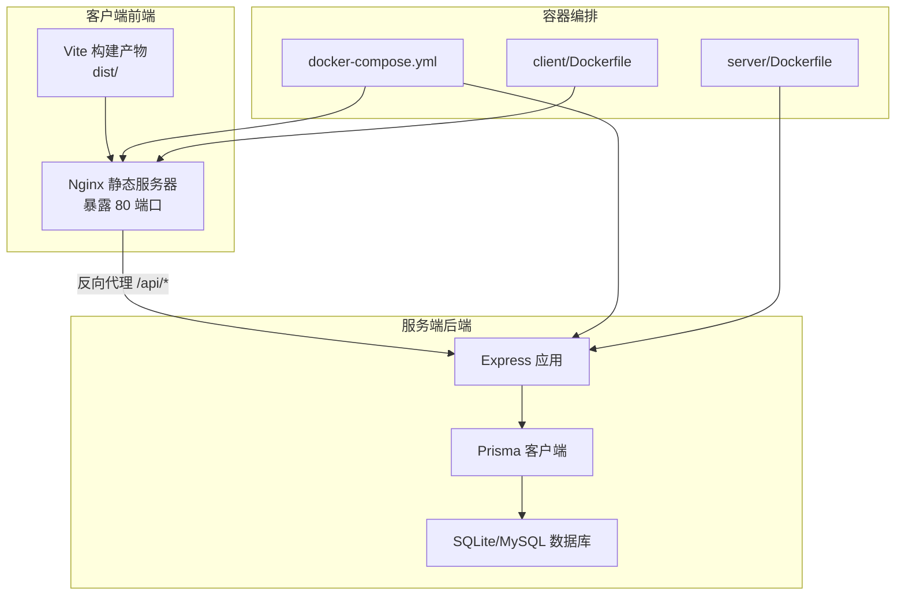
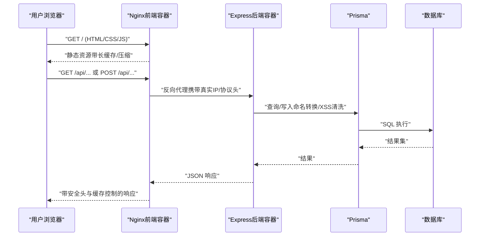
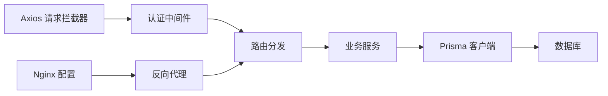

# 生产环境优化

<cite>
**本文引用的文件**
- [nginx.conf](file://client/nginx.conf)
- [vite.config.js](file://client/vite.config.js)
- [package.json（前端）](file://client/package.json)
- [package.json（后端）](file://server/package.json)
- [docker-compose.yml](file://docker-compose.yml)
- [Dockerfile（后端）](file://server/Dockerfile)
- [Dockerfile（前端）](file://client/Dockerfile)
- [PRODUCTION_DEPLOYMENT.md](file://docs/PRODUCTION_DEPLOYMENT.md)
- [deploy.sh](file://deploy.sh)
- [app.js](file://server/src/app.js)
- [prisma.js](file://server/src/lib/prisma.js)
- [logger.js](file://server/src/utils/logger.js)
- [auth.middleware.js](file://server/src/middleware/auth.middleware.js)
- [auth.service.js](file://server/src/services/auth.service.js)
- [schema.prisma](file://server/prisma/schema.prisma)
- [20260614071843_add_performance_indexes](file://server/prisma/migrations/20260614071843_add_performance_indexes/migration.sql)
- [20260623160000_add_composite_indexes](file://server/prisma/migrations/20260623160000_add_composite_indexes/migration.sql)
- [request.js](file://client/src/utils/request.js)
</cite>

## 目录
1. [简介](#简介)
2. [项目结构](#项目结构)
3. [核心组件](#核心组件)
4. [架构总览](#架构总览)
5. [详细组件分析](#详细组件分析)
6. [依赖关系分析](#依赖关系分析)
7. [性能考虑](#性能考虑)
8. [故障排查指南](#故障排查指南)
9. [结论](#结论)
10. [附录](#附录)

## 简介
本指南面向KEC课程管理平台生产环境，围绕Nginx性能调优、前端资源优化、数据库性能优化、内存与GC调优、负载均衡与高可用、以及性能监控与基准测试等方面，结合仓库现有配置与实现进行系统性梳理与落地建议，帮助在保证稳定性的同时提升吞吐与响应速度。

## 项目结构
系统采用前后端分离架构，后端基于Express + Prisma + SQLite/MySQL，前端基于Vue 3 + Vite，通过Nginx提供静态资源与反向代理；同时提供Docker容器化编排与PM2进程守护。

图表来源
- [docker-compose.yml:4-67](file://docker-compose.yml#L4-L67)
- [Dockerfile（后端）:1-46](file://server/Dockerfile#L1-L46)
- [Dockerfile（前端）:1-30](file://client/Dockerfile#L1-L30)
- [nginx.conf:48-63](file://client/nginx.conf#L48-L63)
- [app.js:92-153](file://server/src/app.js#L92-L153)

章节来源
- [docker-compose.yml:1-73](file://docker-compose.yml#L1-L73)
- [Dockerfile（后端）:1-46](file://server/Dockerfile#L1-L46)
- [Dockerfile（前端）:1-30](file://client/Dockerfile#L1-L30)
- [nginx.conf:1-72](file://client/nginx.conf#L1-L72)
- [app.js:1-158](file://server/src/app.js#L1-L158)

## 核心组件
- Nginx静态服务器与反向代理：负责gzip压缩、缓存头、安全头、静态资源长期缓存、API代理与健康检查。
- Express后端：统一CORS、Helmet安全头、请求命名转换、XSS清洗、健康检查、路由分发与错误处理。
- Prisma数据库层：按需建立索引、日志配置、开发/生产差异化行为。
- 前端构建与运行：Vite代码分割、生产构建、Axios拦截器与Token刷新机制。
- 容器化与进程守护：多阶段构建、健康检查、PM2守护、资源限制。

章节来源
- [nginx.conf:1-72](file://client/nginx.conf#L1-L72)
- [app.js:1-158](file://server/src/app.js#L1-L158)
- [prisma.js:1-34](file://server/src/lib/prisma.js#L1-L34)
- [vite.config.js:1-56](file://client/vite.config.js#L1-L56)
- [request.js:1-145](file://client/src/utils/request.js#L1-L145)
- [docker-compose.yml:1-73](file://docker-compose.yml#L1-L73)

## 架构总览
下图展示生产环境典型流量路径：浏览器请求静态页面与API，Nginx作为入口进行缓存与代理，后端处理业务并访问数据库，日志与健康检查贯穿始终。

图表来源
- [nginx.conf:48-63](file://client/nginx.conf#L48-L63)
- [app.js:30-89](file://server/src/app.js#L30-L89)
- [prisma.js:1-34](file://server/src/lib/prisma.js#L1-L34)

## 详细组件分析

### Nginx 性能调优
- 连接与代理
  - 反向代理至后端服务，设置真实IP与协议头，启用HTTP/1.1与升级头以兼容WebSocket等场景。
  - 限制上传体大小，避免过大文件导致资源耗尽。
- 压缩与缓存
  - 启用gzip压缩，设置最小长度与类型白名单，显著降低传输体积。
  - 对静态资源（assets、字体、图片）设置一年缓存与immutable，确保缓存安全。
  - 对index.html不缓存，确保单页应用路由切换获取最新资源。
- 安全头
  - 设置X-Frame-Options、X-Content-Type-Options、Strict-Transport-Security、Referrer-Policy、Permissions-Policy等，强化安全基线。
- 健康检查
  - 提供/health端点，便于容器编排与负载均衡探活。

章节来源
- [nginx.conf:1-72](file://client/nginx.conf#L1-L72)
- [PRODUCTION_DEPLOYMENT.md:135-190](file://docs/PRODUCTION_DEPLOYMENT.md#L135-L190)

### 前端资源优化
- 代码分割
  - 通过Vite的manualChunks将Vue生态、Element Plus、Axios等拆分为独立chunk，提升缓存命中率与并行加载效率。
  - 生产构建关闭source map，减少体积与泄露风险。
- 资源缓存与CDN
  - Nginx对静态资源设置一年缓存与immutable，配合文件名哈希可实现长期缓存。
  - 建议将静态资源迁出至CDN，进一步缩短边缘延迟与提升并发能力。
- Axios拦截器与Token刷新
  - 自动注入Authorization与CSRF Token，统一处理401刷新流程，避免重复登录与死循环。
  - 对403/400/500等错误进行友好提示与日志上报。

章节来源
- [vite.config.js:26-39](file://client/vite.config.js#L26-L39)
- [request.js:17-142](file://client/src/utils/request.js#L17-L142)
- [nginx.conf:34-46](file://client/nginx.conf#L34-L46)

### 数据库性能优化
- 索引优化
  - 已针对classes、plan_course_semesters、plan_textbooks、training_plans等常用查询列建立索引，加速筛选与排序。
  - 新增teaching_assignments复合索引，优化按班级/教师+学期的联合查询。
- 查询与日志
  - Prisma在开发环境开启warn/error事件监听，生产环境仅记录error，降低日志噪声。
  - 健康检查直接执行轻量查询，快速判断数据库连通性。
- 数据库选择
  - SQLite适合小规模部署；大规模场景建议MySQL，配合连接池与主从复制提升吞吐与可用性。

章节来源
- [schema.prisma:48-54](file://server/prisma/schema.prisma#L48-L54)
- [20260614071843_add_performance_indexes:1-24](file://server/prisma/migrations/20260614071843_add_performance_indexes/migration.sql#L1-L24)
- [20260623160000_add_composite_indexes:1-4](file://server/prisma/migrations/20260623160000_add_composite_indexes/migration.sql#L1-L4)
- [prisma.js:1-34](file://server/src/lib/prisma.js#L1-L34)
- [app.js:94-113](file://server/src/app.js#L94-L113)

### 内存使用优化与垃圾回收调优
- Node.js版本与运行时
  - 使用Node 20-alpine镜像，基础镜像更小，利于容器化部署。
  - 建议在生产环境设置合理的Node堆内存上限与GC策略（例如通过环境变量或容器资源限制），避免内存碎片与频繁Full GC。
- 容器资源限制
  - docker-compose中对server/client设置了CPU与内存上限与预留，避免资源争抢影响整体稳定性。
- 日志与审计
  - Winston按文件轮转与大小限制，避免日志膨胀占用磁盘与IO抖动。

章节来源
- [Dockerfile（后端）:18-28](file://server/Dockerfile#L18-L28)
- [docker-compose.yml:35-42](file://docker-compose.yml#L35-L42)
- [logger.js:33-60](file://server/src/utils/logger.js#L33-L60)

### 负载均衡与高可用部署
- 单机多实例
  - 使用PM2在单机多核部署多个后端实例，结合Nginx上游反代实现水平扩展。
- 多节点部署
  - 前端Nginx可部署于多节点，后端通过负载均衡器（如Nginx/HAProxy/LBaaS）分发请求。
  - 数据库建议采用MySQL主从或集群，配合只读副本分流查询压力。
- 健康检查与滚动更新
  - 利用容器健康检查与/health端点，结合编排工具实现平滑发布与故障剔除。

章节来源
- [PRODUCTION_DEPLOYMENT.md:135-190](file://docs/PRODUCTION_DEPLOYMENT.md#L135-L190)
- [app.js:94-113](file://server/src/app.js#L94-L113)
- [docker-compose.yml:28-33](file://docker-compose.yml#L28-L33)

### 性能监控指标与基准测试
- 关键指标
  - 后端：QPS、P95/P99延迟、错误率（4xx/5xx）、数据库慢查询、连接池使用率、内存与GC统计。
  - 前端：首屏时间、资源加载时间、缓存命中率、HTTPS/TLS握手耗时。
  - 基础设施：CPU使用率、内存占用、磁盘IO、网络带宽、连接数。
- 基准测试
  - 使用wrk/ab对/health与核心接口进行压测，逐步提升并发与持续时间，观察瓶颈点。
  - 前端侧使用Lighthouse/Chrome DevTools评估静态资源与交互性能。
- 日志与审计
  - 结合Winston与审计日志，定位异常与热点接口，指导索引与查询优化。

章节来源
- [logger.js:33-60](file://server/src/utils/logger.js#L33-L60)
- [PRODUCTION_DEPLOYMENT.md:251-271](file://docs/PRODUCTION_DEPLOYMENT.md#L251-L271)

## 依赖关系分析
- 组件耦合
  - 前端Axios与后端认证体系紧密耦合（Authorization/CSRF），需保持一致性。
  - Nginx代理与后端CORS/Helmet策略需协调，避免跨域与安全头冲突。
- 外部依赖
  - Node/Prisma/Express/Axios/Nginx/SQLite/MySQL等均为生产关键依赖，版本与补丁需定期评估。
- 循环依赖
  - 当前模块间通过中间件与服务层解耦，未发现明显循环依赖。

图表来源
- [request.js:17-34](file://client/src/utils/request.js#L17-L34)
- [auth.middleware.js:40-106](file://server/src/middleware/auth.middleware.js#L40-L106)
- [app.js:92-153](file://server/src/app.js#L92-L153)
- [prisma.js:1-34](file://server/src/lib/prisma.js#L1-L34)
- [nginx.conf:48-56](file://client/nginx.conf#L48-L56)

章节来源
- [request.js:1-145](file://client/src/utils/request.js#L1-L145)
- [auth.middleware.js:1-129](file://server/src/middleware/auth.middleware.js#L1-L129)
- [app.js:1-158](file://server/src/app.js#L1-L158)
- [prisma.js:1-34](file://server/src/lib/prisma.js#L1-L34)
- [nginx.conf:1-72](file://client/nginx.conf#L1-L72)

## 性能考虑
- Nginx
  - 压缩：合理设置gzip_types与最小长度，避免对已压缩资源重复压缩。
  - 缓存：对静态资源使用immutable与一年缓存，结合CDN实现全球加速。
  - 代理：启用HTTP/1.1与必要的升级头，设置超时与连接池参数。
- 后端
  - CORS与Helmet：生产环境严格白名单，避免宽松策略导致安全与兼容问题。
  - 命名转换与XSS清洗：统一数据命名与输入净化，减少异常与注入风险。
  - 健康检查：轻量查询，避免阻塞数据库。
- 数据库
  - 索引：根据查询模式持续优化，关注复合索引与覆盖索引。
  - 连接池：在MySQL场景建议引入连接池（如sequelize/mysql2/pool），并结合只读副本分流。
- 前端
  - 代码分割：按功能模块与第三方库拆分，提升缓存命中与并行加载。
  - 请求拦截：统一处理401刷新与错误提示，减少重复逻辑。
- 容器与进程
  - 资源限制：合理设置CPU/内存上限与预留，避免“邻居干扰”。
  - PM2：启用进程守护与开机自启，结合日志轮转与健康检查。

章节来源
- [nginx.conf:7-23](file://client/nginx.conf#L7-L23)
- [app.js:41-89](file://server/src/app.js#L41-L89)
- [schema.prisma:48-54](file://server/prisma/schema.prisma#L48-L54)
- [vite.config.js:26-39](file://client/vite.config.js#L26-L39)
- [docker-compose.yml:35-42](file://docker-compose.yml#L35-L42)
- [PRODUCTION_DEPLOYMENT.md:135-190](file://docs/PRODUCTION_DEPLOYMENT.md#L135-L190)

## 故障排查指南
- 健康检查失败
  - 检查后端/数据库连通性、Prisma生成与迁移状态，确认/health端点可达。
- CORS错误
  - 确认CORS_ORIGINS包含生产域名，重启后端使配置生效。
- 数据库锁定（SQLite）
  - 检查文件权限与锁文件，必要时调整权限或迁移到MySQL。
- JWT认证失败
  - 校验JWT密钥长度与格式，确保独立密钥与过期策略一致。
- 日志与审计
  - 使用PM2日志与Winston文件日志定位错误，结合审计日志追踪用户行为。

章节来源
- [deploy.sh:224-239](file://deploy.sh#L224-L239)
- [PRODUCTION_DEPLOYMENT.md:204-250](file://docs/PRODUCTION_DEPLOYMENT.md#L204-L250)
- [logger.js:33-60](file://server/src/utils/logger.js#L33-L60)
- [app.js:94-113](file://server/src/app.js#L94-L113)

## 结论
通过Nginx压缩与缓存、前端代码分割与CDN、数据库索引优化与连接池、容器资源限制与PM2守护，以及完善的监控与基准测试流程，KEC课程管理平台可在生产环境中获得稳定、高效、可扩展的性能表现。建议在上线前完成压测与容量规划，并持续跟踪关键指标以指导迭代优化。

## 附录
- 部署脚本要点
  - 自动化安装依赖、生成Prisma客户端、构建前端、PM2守护与健康检查验证。
- Nginx配置要点
  - 反向代理、安全头、缓存、压缩与健康检查端点。
- 前端构建要点
  - 代码分割、生产构建、Axios拦截器与Token刷新。

章节来源
- [deploy.sh:92-211](file://deploy.sh#L92-L211)
- [nginx.conf:48-70](file://client/nginx.conf#L48-L70)
- [vite.config.js:26-39](file://client/vite.config.js#L26-L39)
- [request.js:51-112](file://client/src/utils/request.js#L51-L112)