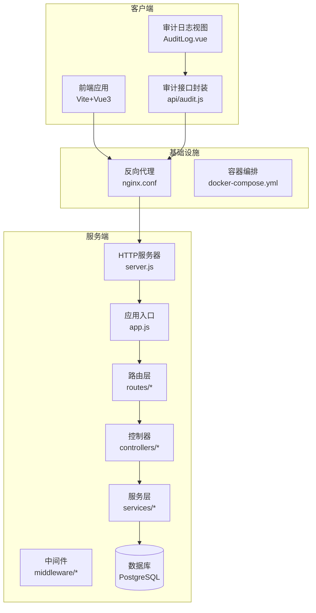
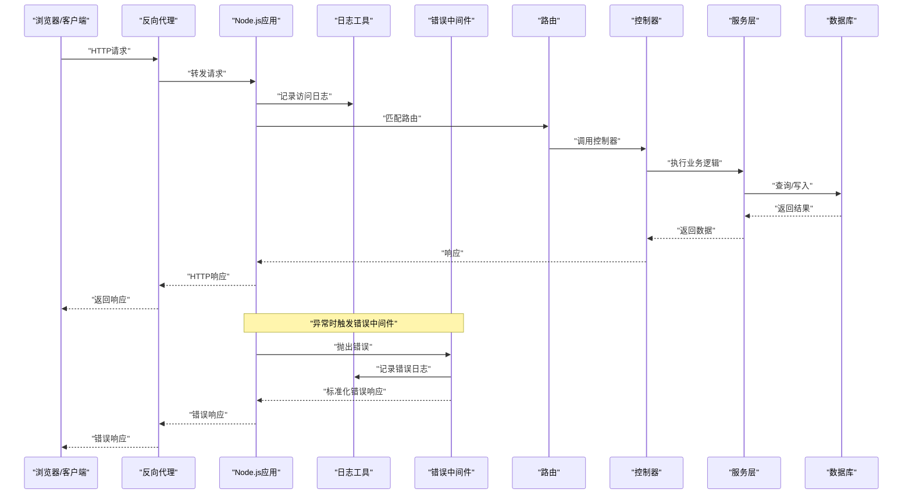
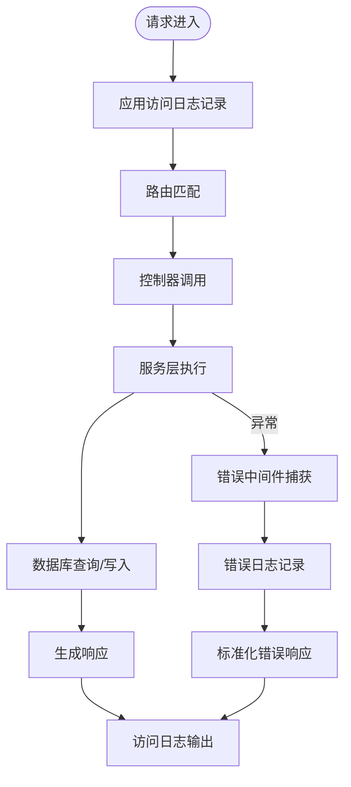
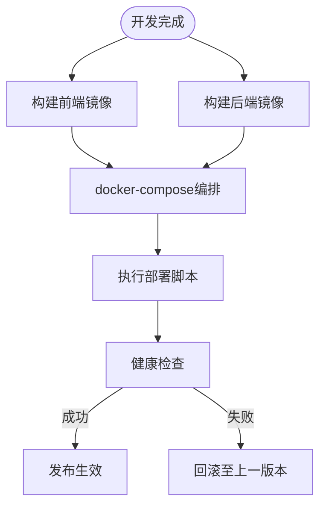
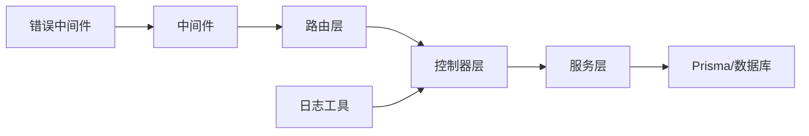

# 监控告警

<cite>
**本文引用的文件**
- [server/src/utils/logger.js](file://server/src/utils/logger.js)
- [server/src/middleware/error.js](file://server/src/middleware/error.js)
- [server/src/routes/audit.routes.js](file://server/src/routes/audit.routes.js)
- [server/src/controllers/audit.controller.js](file://server/src/controllers/audit.controller.js)
- [server/src/services/audit.service.js](file://server/src/services/audit.service.js)
- [server/src/app.js](file://server/src/app.js)
- [server/src/server.js](file://server/src/server.js)
- [client/src/views/system/AuditLog.vue](file://client/src/views/system/AuditLog.vue)
- [client/src/api/audit.js](file://client/src/api/audit.js)
- [server/prisma/schema.prisma](file://server/prisma/schema.prisma)
- [server/prisma/migrations/20260611161232_init/migration.sql](file://server/prisma/migrations/20260611161232_init/migration.sql)
- [server/prisma/migrations/20260614071843_add_performance_indexes/migration.sql](file://server/prisma/migrations/20260614071843_add_performance_indexes/migration.sql)
- [server/package.json](file://server/package.json)
- [client/package.json](file://client/package.json)
- [docker-compose.yml](file://docker-compose.yml)
- [deploy.sh](file://deploy.sh)
- [deploy_ssh.sh](file://deploy_ssh.sh)
- [server/Dockerfile](file://server/Dockerfile)
- [client/Dockerfile](file://client/Dockerfile)
- [server/nginx.conf](file://server/nginx.conf)
- [client/nginx.conf](file://client/nginx.conf)
- [docs/PRODUCTION_DEPLOYMENT.md](file://docs/PRODUCTION_DEPLOYMENT.md)
- [docs/kec-manager-前端性能诊断报告.md](file://docs/kec-manager-前端性能诊断报告.md)
</cite>

## 目录
1. [简介](#简介)
2. [项目结构](#项目结构)
3. [核心组件](#核心组件)
4. [架构总览](#架构总览)
5. [详细组件分析](#详细组件分析)
6. [依赖关系分析](#依赖关系分析)
7. [性能考量](#性能考量)
8. [故障排查指南](#故障排查指南)
9. [结论](#结论)
10. [附录](#附录)

## 简介
本指南面向KEC课程管理平台的运维与开发团队，提供一套可落地的监控告警系统配置方案。内容覆盖日志采集与分析（访问日志、错误日志、业务审计日志）、系统指标监控（CPU、内存、磁盘、网络）、应用性能监控（APM）集成建议、告警规则与通知渠道、健康检查接口实现、自动化运维脚本以及故障诊断与应急响应流程。为确保与现有代码库一致，本指南严格基于仓库中的实际文件进行分析与建议。

## 项目结构
系统由前后端分离架构组成：前端采用Vite+Vue3，后端基于Node.js+Express，数据库使用Prisma+PostgreSQL，容器化部署通过Docker与Compose编排。生产部署文档与前端性能诊断报告提供了部署与性能参考。

**图表来源**
- [server/src/server.js:1-50](file://server/src/server.js#L1-L50)
- [server/src/app.js:1-120](file://server/src/app.js#L1-L120)
- [server/src/routes/audit.routes.js:1-80](file://server/src/routes/audit.routes.js#L1-L80)
- [client/src/views/system/AuditLog.vue:1-200](file://client/src/views/system/AuditLog.vue#L1-L200)
- [client/src/api/audit.js:1-120](file://client/src/api/audit.js#L1-L120)
- [docker-compose.yml:1-120](file://docker-compose.yml#L1-L120)
- [server/nginx.conf:1-120](file://server/nginx.conf#L1-L120)
- [client/nginx.conf:1-120](file://client/nginx.conf#L1-L120)

**章节来源**
- [server/src/server.js:1-120](file://server/src/server.js#L1-L120)
- [server/src/app.js:1-120](file://server/src/app.js#L1-L120)
- [docker-compose.yml:1-120](file://docker-compose.yml#L1-L120)
- [docs/PRODUCTION_DEPLOYMENT.md:1-200](file://docs/PRODUCTION_DEPLOYMENT.md#L1-L200)

## 核心组件
- 日志与审计
  - 后端统一日志工具：提供结构化日志输出，便于接入集中式日志系统。
  - 错误中间件：捕获未处理异常，生成标准化错误响应与日志记录。
  - 审计日志：定义审计事件模型与路由，支持分页查询与导出。
- 监控与告警
  - 健康检查接口：提供存活/就绪探针，便于Kubernetes或负载均衡器探测。
  - 指标采集：结合Nginx访问日志与应用日志，建立CPU/内存/磁盘/网络等指标。
  - APM集成：建议接入APM以追踪慢查询与错误率。
  - 告警规则：基于阈值与趋势设定规则，并配置邮件/IM通知渠道。
- 自动化运维
  - Docker镜像构建与Compose编排。
  - 部署脚本与SSH部署脚本，支持一键上线与回滚。
- 性能诊断
  - 生产部署文档与前端性能诊断报告，提供优化建议与问题定位方法。

**章节来源**
- [server/src/utils/logger.js:1-200](file://server/src/utils/logger.js#L1-L200)
- [server/src/middleware/error.js:1-120](file://server/src/middleware/error.js#L1-L120)
- [server/src/routes/audit.routes.js:1-120](file://server/src/routes/audit.routes.js#L1-L120)
- [server/src/controllers/audit.controller.js:1-200](file://server/src/controllers/audit.controller.js#L1-L200)
- [server/src/services/audit.service.js:1-200](file://server/src/services/audit.service.js#L1-L200)
- [server/src/app.js:1-120](file://server/src/app.js#L1-L120)
- [server/src/server.js:1-120](file://server/src/server.js#L1-L120)
- [docs/PRODUCTION_DEPLOYMENT.md:1-200](file://docs/PRODUCTION_DEPLOYMENT.md#L1-L200)
- [docs/kec-manager-前端性能诊断报告.md:1-200](file://docs/kec-manager-前端性能诊断报告.md#L1-L200)

## 架构总览
下图展示从客户端到数据库的完整链路，标注了日志与监控的关键节点。

**图表来源**
- [server/src/server.js:1-120](file://server/src/server.js#L1-L120)
- [server/src/app.js:1-120](file://server/src/app.js#L1-L120)
- [server/src/utils/logger.js:1-200](file://server/src/utils/logger.js#L1-L200)
- [server/src/middleware/error.js:1-120](file://server/src/middleware/error.js#L1-L120)
- [server/src/routes/audit.routes.js:1-120](file://server/src/routes/audit.routes.js#L1-L120)
- [server/src/controllers/audit.controller.js:1-200](file://server/src/controllers/audit.controller.js#L1-L200)
- [server/src/services/audit.service.js:1-200](file://server/src/services/audit.service.js#L1-L200)

## 详细组件分析

### 日志收集与分析配置
- 访问日志
  - Nginx访问日志：在反向代理层统一记录请求路径、状态码、耗时、IP等信息，便于后续聚合分析。
  - 应用访问日志：通过日志工具记录请求开始/结束、用户标识、路由、参数摘要等，建议输出JSON格式以便机器解析。
- 错误日志
  - 错误中间件：捕获所有未处理异常，记录堆栈、时间戳、请求上下文，并返回标准化错误响应。
  - 结构化错误字段：包含错误类型、消息、请求ID、用户ID、路由、时间等，便于检索与统计。
- 业务日志（审计）
  - 审计事件模型：记录操作人、操作类型、对象、结果、时间、IP、UA等。
  - 审计接口：提供分页查询、筛选、排序与导出能力，前端通过API封装调用。
- 日志存储与索引
  - 建议将Nginx与应用日志输出至标准输出或文件，配合容器日志驱动统一收集。
  - 使用集中式日志系统（如ELK/EFK）进行聚合、索引与可视化；对审计日志单独建表并建立复合索引以提升查询性能。

**图表来源**
- [server/src/utils/logger.js:1-200](file://server/src/utils/logger.js#L1-L200)
- [server/src/middleware/error.js:1-120](file://server/src/middleware/error.js#L1-L120)
- [server/src/app.js:1-120](file://server/src/app.js#L1-L120)

**章节来源**
- [server/src/utils/logger.js:1-200](file://server/src/utils/logger.js#L1-L200)
- [server/src/middleware/error.js:1-120](file://server/src/middleware/error.js#L1-L120)
- [server/src/routes/audit.routes.js:1-120](file://server/src/routes/audit.routes.js#L1-L120)
- [server/src/controllers/audit.controller.js:1-200](file://server/src/controllers/audit.controller.js#L1-L200)
- [server/src/services/audit.service.js:1-200](file://server/src/services/audit.service.js#L1-L200)
- [server/nginx.conf:1-120](file://server/nginx.conf#L1-L120)
- [client/nginx.conf:1-120](file://client/nginx.conf#L1-L120)

### 系统指标监控配置
- CPU使用率
  - 容器/主机层面：通过系统监控工具采集CPU使用率、负载、进程数等。
  - 应用层面：Node.js可利用进程级指标（如heapUsed、loadavg）辅助判断。
- 内存使用率
  - 采集RSS、HeapUsed、HeapTotal等指标，结合GC频率观察内存泄漏风险。
- 磁盘使用率
  - 监控根分区、日志目录、数据库卷使用率，设置阈值告警。
- 网络使用率
  - 采集入/出带宽、连接数、并发请求数，识别异常流量或DDoS迹象。
- 指标采集与可视化
  - 建议使用Prometheus+Grafana组合，Prometheus抓取应用与系统指标，Grafana进行仪表板展示。

**章节来源**
- [server/src/server.js:1-120](file://server/src/server.js#L1-L120)
- [server/src/app.js:1-120](file://server/src/app.js#L1-L120)
- [server/package.json:1-200](file://server/package.json#L1-L200)
- [client/package.json:1-200](file://client/package.json#L1-L200)

### 应用性能监控（APM）集成方案
- 慢查询追踪
  - 数据库慢查询：开启慢查询日志，结合APM的数据库调用追踪，定位耗时SQL与索引缺失。
  - 服务端慢调用：记录控制器到服务层的耗时，结合分布式追踪（Trace ID）串联请求链路。
- 错误率监控
  - 统计HTTP 5xx错误占比、数据库异常次数、业务异常比率，设置阈值告警。
- APM建议
  - 推荐使用具备Node.js与PostgreSQL集成能力的APM，支持自动注入与自定义Span。
  - 将审计日志作为业务可观测性补充，用于合规与审计追踪。

**章节来源**
- [server/src/services/audit.service.js:1-200](file://server/src/services/audit.service.js#L1-L200)
- [server/prisma/schema.prisma:1-200](file://server/prisma/schema.prisma#L1-L200)
- [server/prisma/migrations/20260614071843_add_performance_indexes/migration.sql:1-200](file://server/prisma/migrations/20260614071843_add_performance_indexes/migration.sql#L1-L200)

### 健康检查接口实现
- 存活探针（livenessProbe）
  - 返回200即表示进程存活，避免被K8s重启。
- 就绪探针（readinessProbe）
  - 在数据库连接可用、关键依赖就绪后再标记为就绪。
- 建议实现
  - 在应用入口中新增/health/liveness与/health/readiness两个端点，分别返回“alive”与“ready”。

**章节来源**
- [server/src/server.js:1-120](file://server/src/server.js#L1-L120)
- [server/src/app.js:1-120](file://server/src/app.js#L1-L120)

### 告警规则配置与通知渠道
- 告警规则示例
  - CPU使用率 > 85% 持续5分钟
  - 内存使用率 > 80% 持续10分钟
  - 磁盘使用率 > 90%
  - 网络连接数 > 预设阈值
  - 5xx错误率 > 3% 持续2分钟
  - 审计事件异常增长（如批量删除/修改）
- 通知渠道
  - 邮件、企业微信/钉钉机器人、PagerDuty等。
  - 建议按级别分级通知（P1紧急、P2严重、P3一般）。

**章节来源**
- [server/src/middleware/error.js:1-120](file://server/src/middleware/error.js#L1-L120)
- [server/src/utils/logger.js:1-200](file://server/src/utils/logger.js#L1-L200)

### 自动化运维脚本
- 镜像构建
  - 前后端分别使用各自Dockerfile构建镜像，确保缓存层优化与最小化体积。
- 编排与部署
  - 使用docker-compose.yml定义服务、网络、卷与环境变量，支持多环境切换。
- 部署脚本
  - deploy.sh：拉取镜像、停止旧容器、启动新容器、清理悬空镜像。
  - deploy_ssh.sh：通过SSH远程执行部署命令，适合CI/CD流水线。
- 回滚策略
  - 保留最近N个版本镜像，失败时快速回滚至上一稳定版本。

**图表来源**
- [server/Dockerfile:1-200](file://server/Dockerfile#L1-L200)
- [client/Dockerfile:1-200](file://client/Dockerfile#L1-L200)
- [docker-compose.yml:1-120](file://docker-compose.yml#L1-L120)
- [deploy.sh:1-200](file://deploy.sh#L1-L200)
- [deploy_ssh.sh:1-200](file://deploy_ssh.sh#L1-L200)

**章节来源**
- [server/Dockerfile:1-200](file://server/Dockerfile#L1-L200)
- [client/Dockerfile:1-200](file://client/Dockerfile#L1-L200)
- [docker-compose.yml:1-120](file://docker-compose.yml#L1-L120)
- [deploy.sh:1-200](file://deploy.sh#L1-L200)
- [deploy_ssh.sh:1-200](file://deploy_ssh.sh#L1-L200)

### 故障诊断工具与应急响应流程
- 诊断工具
  - 日志检索：按时间、用户ID、路由、错误类型过滤。
  - 性能诊断：前端性能诊断报告提供页面加载、渲染、资源瓶颈分析。
  - 数据库诊断：根据迁移文件与索引建议，检查慢查询与锁等待。
- 应急响应
  - P1：立即隔离、回滚、扩容/降级、修复并复盘。
  - P2：快速定位、临时修复、安排修复计划。
  - P3：记录与跟踪、优化与预防。

**章节来源**
- [docs/kec-manager-前端性能诊断报告.md:1-200](file://docs/kec-manager-前端性能诊断报告.md#L1-L200)
- [server/prisma/migrations/20260611161232_init/migration.sql:1-200](file://server/prisma/migrations/20260611161232_init/migration.sql#L1-L200)
- [server/prisma/migrations/20260614071843_add_performance_indexes/migration.sql:1-200](file://server/prisma/migrations/20260614071843_add_performance_indexes/migration.sql#L1-L200)

## 依赖关系分析
- 组件耦合
  - 路由依赖控制器，控制器依赖服务层，服务层依赖数据库访问层。
  - 中间件横切关注点（鉴权、校验、错误处理）贯穿请求链路。
- 外部依赖
  - Nginx负责静态资源与反向代理。
  - Docker与Compose负责容器编排与部署。
  - Prisma负责数据库Schema与查询抽象。

**图表来源**
- [server/src/app.js:1-120](file://server/src/app.js#L1-L120)
- [server/src/routes/audit.routes.js:1-120](file://server/src/routes/audit.routes.js#L1-L120)
- [server/src/controllers/audit.controller.js:1-200](file://server/src/controllers/audit.controller.js#L1-L200)
- [server/src/services/audit.service.js:1-200](file://server/src/services/audit.service.js#L1-L200)
- [server/src/middleware/error.js:1-120](file://server/src/middleware/error.js#L1-L120)
- [server/src/utils/logger.js:1-200](file://server/src/utils/logger.js#L1-L200)

**章节来源**
- [server/src/app.js:1-120](file://server/src/app.js#L1-L120)
- [server/src/routes/audit.routes.js:1-120](file://server/src/routes/audit.routes.js#L1-L120)
- [server/src/controllers/audit.controller.js:1-200](file://server/src/controllers/audit.controller.js#L1-L200)
- [server/src/services/audit.service.js:1-200](file://server/src/services/audit.service.js#L1-L200)
- [server/src/middleware/error.js:1-120](file://server/src/middleware/error.js#L1-L120)
- [server/src/utils/logger.js:1-200](file://server/src/utils/logger.js#L1-L200)

## 性能考量
- 查询性能
  - 参考迁移文件中的索引与约束设计，避免全表扫描与N+1查询。
- 连接池与超时
  - 设置合理的数据库连接池大小与查询超时，防止资源耗尽。
- 缓存策略
  - 对热点数据与只读列表增加缓存，降低数据库压力。
- 前端性能
  - 参考前端性能诊断报告，优化首屏加载、懒加载与资源压缩。

**章节来源**
- [server/prisma/migrations/20260614071843_add_performance_indexes/migration.sql:1-200](file://server/prisma/migrations/20260614071843_add_performance_indexes/migration.sql#L1-L200)
- [docs/kec-manager-前端性能诊断报告.md:1-200](file://docs/kec-manager-前端性能诊断报告.md#L1-L200)

## 故障排查指南
- 常见问题定位步骤
  - 查看Nginx与应用访问日志，确认请求路径与状态码。
  - 检查错误中间件输出，定位异常发生位置与堆栈。
  - 审计日志核对用户行为与权限，排除越权或误操作。
  - 数据库慢查询与索引缺失导致的延迟。
- 快速恢复手段
  - 回滚至上一稳定版本镜像。
  - 扩容实例或临时关闭高负载功能。
  - 清理磁盘空间与重建索引。

**章节来源**
- [server/src/middleware/error.js:1-120](file://server/src/middleware/error.js#L1-L120)
- [server/src/utils/logger.js:1-200](file://server/src/utils/logger.js#L1-L200)
- [server/src/services/audit.service.js:1-200](file://server/src/services/audit.service.js#L1-L200)
- [deploy.sh:1-200](file://deploy.sh#L1-L200)
- [deploy_ssh.sh:1-200](file://deploy_ssh.sh#L1-L200)

## 结论
通过在现有代码基础上完善日志体系、引入APM与系统指标监控、规范健康检查与告警规则，并配套自动化运维脚本与应急流程，KEC课程管理平台可以实现可观测、可预警、可恢复的稳定运行。建议优先落地访问日志与审计日志的结构化输出，再逐步扩展到系统指标与APM集成。

## 附录
- 审计日志前端展示与交互
  - 审计日志视图提供分页、筛选与导出功能，便于运营与安全部门追溯。
- 生产部署参考
  - 参考生产部署文档与前端性能诊断报告，制定上线窗口与回滚预案。

**章节来源**
- [client/src/views/system/AuditLog.vue:1-200](file://client/src/views/system/AuditLog.vue#L1-L200)
- [client/src/api/audit.js:1-120](file://client/src/api/audit.js#L1-L120)
- [docs/PRODUCTION_DEPLOYMENT.md:1-200](file://docs/PRODUCTION_DEPLOYMENT.md#L1-L200)
- [docs/kec-manager-前端性能诊断报告.md:1-200](file://docs/kec-manager-前端性能诊断报告.md#L1-L200)