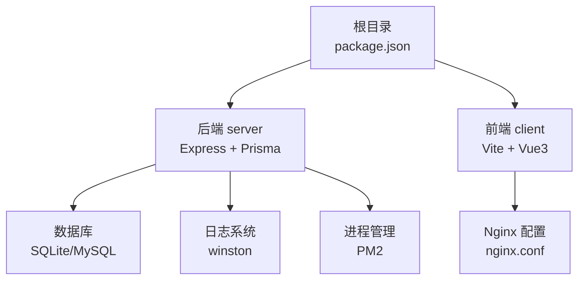
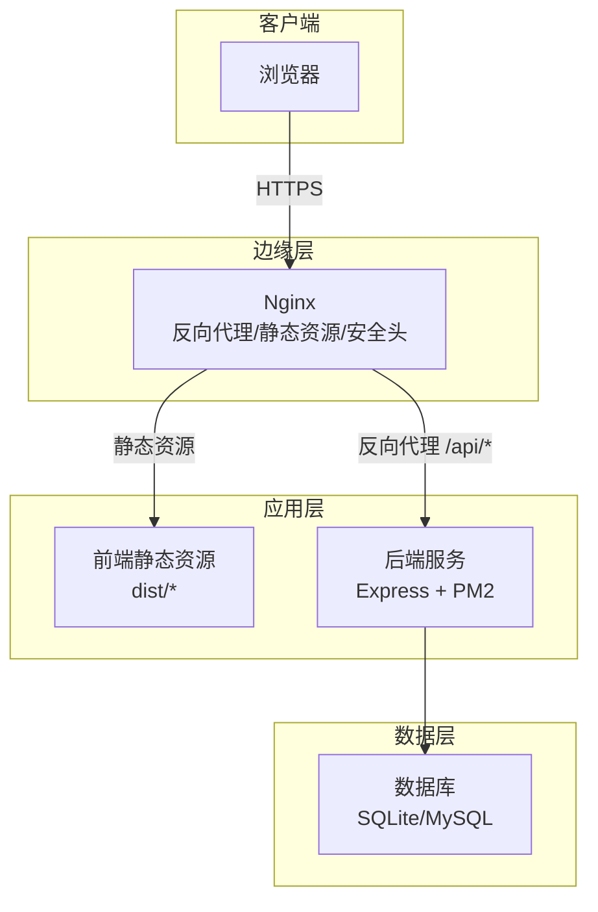
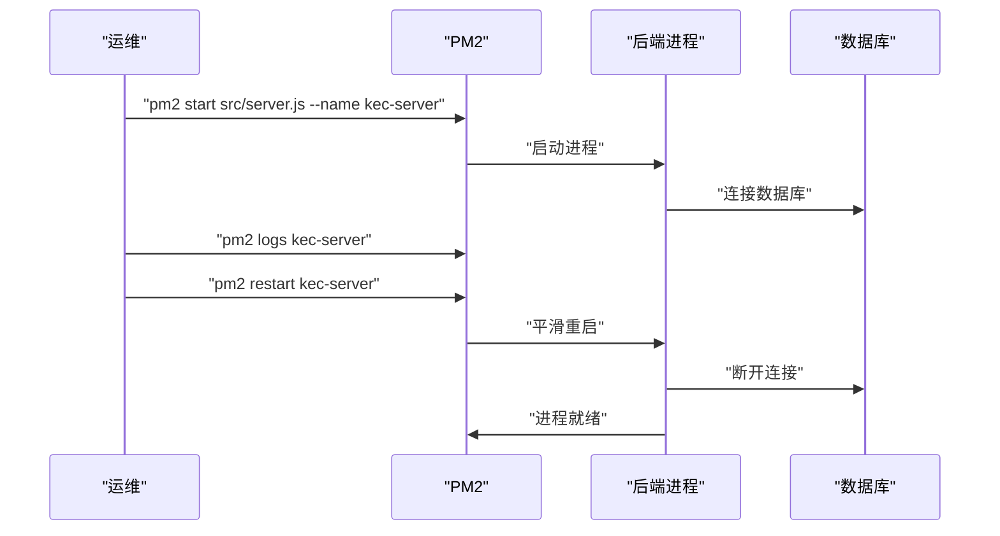
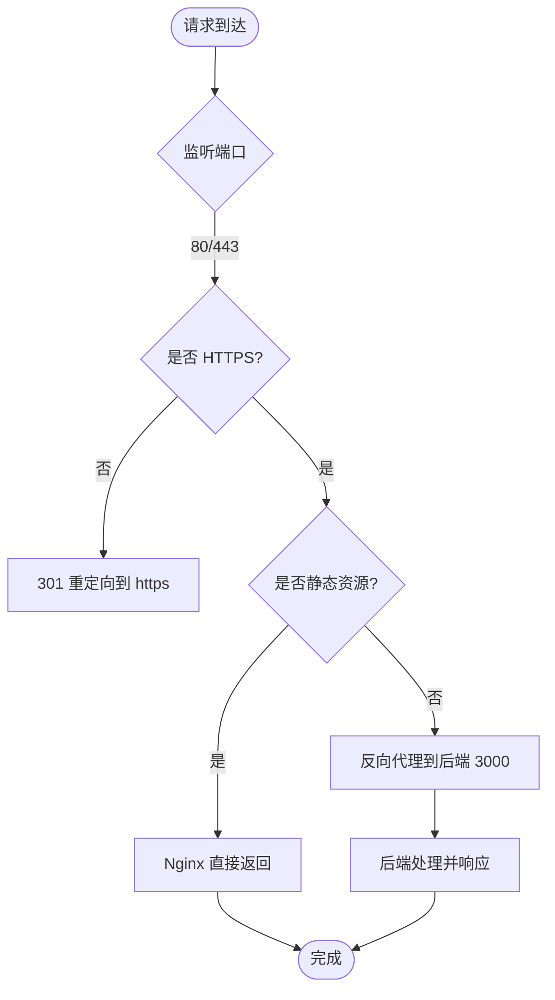
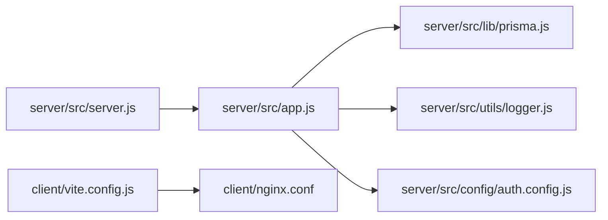

# 裸机部署

<cite>
**本文引用的文件**
- [package.json](file://package.json)
- [server/package.json](file://server/package.json)
- [client/package.json](file://client/package.json)
- [deploy.sh](file://deploy.sh)
- [deploy_ssh.sh](file://deploy_ssh.sh)
- [server/src/app.js](file://server/src/app.js)
- [server/src/server.js](file://server/src/server.js)
- [client/nginx.conf](file://client/nginx.conf)
- [server/src/lib/prisma.js](file://server/src/lib/prisma.js)
- [server/src/utils/logger.js](file://server/src/utils/logger.js)
- [docs/PRODUCTION_DEPLOYMENT.md](file://docs/PRODUCTION_DEPLOYMENT.md)
- [server/prisma/schema.prisma](file://server/prisma/schema.prisma)
- [server/src/config/auth.config.js](file://server/src/config/auth.config.js)
- [client/vite.config.js](file://client/vite.config.js)
- [server/scripts/init-settings.js](file://server/scripts/init-settings.js)
- [server/scripts/reset-database.js](file://server/scripts/reset-database.js)
- [start-dev.sh](file://start-dev.sh)
- [start-dev.bat](file://start-dev.bat)
</cite>

## 目录
1. [简介](#简介)
2. [项目结构](#项目结构)
3. [核心组件](#核心组件)
4. [架构总览](#架构总览)
5. [详细组件分析](#详细组件分析)
6. [依赖关系分析](#依赖关系分析)
7. [性能考虑](#性能考虑)
8. [故障排查指南](#故障排查指南)
9. [结论](#结论)
10. [附录](#附录)

## 简介
本指南面向在裸机环境中部署 KECCourse 平台（后端 Node.js + 前端 Vite + Nginx + SQLite/MySQL）的运维与开发人员，提供从环境准备、依赖安装、数据库配置、PM2 进程管理、Nginx 反向代理与 SSL、生产性能调优、启动脚本与环境变量、到部署后验证与监控的完整流程。

## 项目结构
- 顶层包含根脚本与打包配置，后端 server 使用 Express + Prisma，前端 client 使用 Vite + Vue3，Nginx 配置位于前端目录。
- 部署脚本提供一键化安装、迁移、构建与 PM2 启动；生产部署文档提供更细粒度的步骤与最佳实践。

图示来源
- [package.json:1-25](file://package.json#L1-L25)
- [server/package.json:1-53](file://server/package.json#L1-L53)
- [client/package.json:1-33](file://client/package.json#L1-L33)
- [client/nginx.conf:1-72](file://client/nginx.conf#L1-L72)

章节来源
- [package.json:1-25](file://package.json#L1-L25)
- [server/package.json:1-53](file://server/package.json#L1-L53)
- [client/package.json:1-33](file://client/package.json#L1-L33)

## 核心组件
- 后端服务：基于 Express，集成安全头、CORS、XSS 清洗、命名转换、健康检查、统一错误处理与优雅关机。
- 数据库：Prisma 客户端，支持 SQLite（默认）与 MySQL（推荐生产）。
- 前端：Vite 构建，Vue3 应用，包含代理配置与分包策略。
- Nginx：静态资源缓存、gzip 压缩、安全头、API 反代与健康检查。
- PM2：进程守护、开机自启、日志管理与自动重启。
- 日志：winston 文件与控制台输出，支持审计日志与错误分级。

章节来源
- [server/src/app.js:1-158](file://server/src/app.js#L1-L158)
- [server/src/server.js:1-66](file://server/src/server.js#L1-L66)
- [server/src/lib/prisma.js:1-34](file://server/src/lib/prisma.js#L1-L34)
- [client/nginx.conf:1-72](file://client/nginx.conf#L1-L72)
- [server/src/utils/logger.js:1-96](file://server/src/utils/logger.js#L1-L96)

## 架构总览
下图展示了生产环境典型拓扑：客户端浏览器经 Nginx 反向代理访问后端 API，静态资源由 Nginx 提供；后端通过 Prisma 访问 SQLite 或 MySQL。

图示来源
- [client/nginx.conf:1-72](file://client/nginx.conf#L1-L72)
- [server/src/app.js:1-158](file://server/src/app.js#L1-L158)
- [server/src/lib/prisma.js:1-34](file://server/src/lib/prisma.js#L1-L34)

## 详细组件分析

### Node.js 环境准备与依赖安装
- 环境要求
  - Node.js 版本：后端脚本声明最低 Node 20，生产文档建议 Node 18+。
  - npm 版本：后端脚本声明 npm 10+。
- 依赖安装
  - 根目录：安装通用工具与并发依赖。
  - server：安装生产依赖（含 Prisma CLI）。
  - client：安装构建依赖（Vite、esbuild 等）。
- 前端构建
  - 使用 Vite 构建产物复制至 Nginx 目录。
  - 构建后清理 devDependencies，减小生产体积。

章节来源
- [server/package.json:7-10](file://server/package.json#L7-L10)
- [server/package.json:11-26](file://server/package.json#L11-L26)
- [client/package.json:6-12](file://client/package.json#L6-L12)
- [deploy.sh:92-98](file://deploy.sh#L92-L98)
- [deploy.sh:178-189](file://deploy.sh#L178-L189)
- [deploy_ssh.sh:222-242](file://deploy_ssh.sh#L222-L242)
- [deploy_ssh.sh:278-287](file://deploy_ssh.sh#L278-L287)

### 数据库配置（SQLite/MySQL）
- SQLite（默认）
  - 数据库存放于 server/data/kec.db。
  - 通过 Prisma schema 指定 provider 为 sqlite，DATABASE_URL 指向该文件。
  - 部署脚本会执行迁移与种子数据初始化。
- MySQL（推荐生产）
  - 在生产文档中提供创建数据库与用户的 SQL 示例。
  - 将 DATABASE_URL 切换为 mysql://... 形式。
- 迁移与种子
  - 迁移：npx prisma migrate deploy。
  - 生成客户端：npx prisma generate。
  - 种子数据：npm run db:seed 或脚本 init-settings。
- 手工修复
  - 若迁移失败，可尝试 reset 后重新 deploy。

章节来源
- [server/prisma/schema.prisma:1-8](file://server/prisma/schema.prisma#L1-L8)
- [docs/PRODUCTION_DEPLOYMENT.md:13-31](file://docs/PRODUCTION_DEPLOYMENT.md#L13-L31)
- [docs/PRODUCTION_DEPLOYMENT.md:95-107](file://docs/PRODUCTION_DEPLOYMENT.md#L95-L107)
- [deploy.sh:150-160](file://deploy.sh#L150-L160)
- [server/scripts/init-settings.js:23-35](file://server/scripts/init-settings.js#L23-L35)

### PM2 进程管理（守护、自动重启、日志）
- 安装与启动
  - 自动检测并安装 PM2，启动后端服务 kec-server。
  - 保存配置并设置开机自启。
- 进程管理
  - 支持 pm2 status、pm2 logs、pm2 restart、pm2 delete 等常用命令。
- 健康检查
  - 部署脚本对 /api/health 与 /api/settings 进行验证。
- 优雅关机
  - 后端监听 SIGINT/SIGTERM，关闭 HTTP 服务器并断开 Prisma 连接，超时强制退出。

图示来源
- [deploy.sh:194-211](file://deploy.sh#L194-L211)
- [deploy_ssh.sh:289-313](file://deploy_ssh.sh#L289-L313)
- [server/src/server.js:46-66](file://server/src/server.js#L46-L66)

章节来源
- [deploy.sh:194-211](file://deploy.sh#L194-L211)
- [deploy_ssh.sh:289-313](file://deploy_ssh.sh#L289-L313)
- [server/src/server.js:10-40](file://server/src/server.js#L10-L40)

### Nginx 反向代理与 SSL
- 反代配置要点
  - 监听 80/443，HTTPS 重定向（可选）。
  - 前端静态资源 root 指向 Nginx 目录，启用 try_files 支持 Vue Router history 模式。
  - /api/ 代理到后端 3000 端口，设置 X-Real-IP、X-Forwarded-* 等头部。
  - gzip 压缩与安全头（X-Frame-Options、X-Content-Type-Options、Strict-Transport-Security 等）。
  - 静态资源长期缓存（assets、字体、图片）。
- SSL 证书
  - 生产文档提供 Let’s Encrypt 证书路径示例。
  - 建议开启 HTTP/2 与 HSTS。
- 健康检查
  - Nginx 提供 /health 返回 healthy 文本，便于外部探测。

图示来源
- [client/nginx.conf:1-72](file://client/nginx.conf#L1-L72)
- [docs/PRODUCTION_DEPLOYMENT.md:135-190](file://docs/PRODUCTION_DEPLOYMENT.md#L135-L190)

章节来源
- [client/nginx.conf:1-72](file://client/nginx.conf#L1-L72)
- [docs/PRODUCTION_DEPLOYMENT.md:135-190](file://docs/PRODUCTION_DEPLOYMENT.md#L135-L190)

### 环境变量与启动脚本
- 关键环境变量
  - NODE_ENV=production
  - DATABASE_URL=sqlite/mysql
  - PORT=3000
  - JWT_SECRET/JWT_REFRESH_SECRET/JWT_DOWNLOAD_SECRET（生产必须独立配置）
  - CORS_ORIGINS=前端域名列表
  - LOG_LEVEL=info/debug/warn/error
  - MAX_FILE_SIZE=10（MB）
- 启动脚本
  - deploy.sh：本地/远程一键部署，包含依赖安装、迁移、构建、PM2 启动与健康检查。
  - deploy_ssh.sh：远程部署（支持仅更新、仅备份、跳过备份等模式）。
  - start-dev.sh/start-dev.bat：开发环境快速启动（重置数据库、同时启动前后端）。

章节来源
- [deploy.sh:101-146](file://deploy.sh#L101-L146)
- [server/src/config/auth.config.js:7-37](file://server/src/config/auth.config.js#L7-L37)
- [server/src/app.js:42-51](file://server/src/app.js#L42-L51)
- [server/src/utils/logger.js:35-36](file://server/src/utils/logger.js#L35-L36)
- [deploy.sh:101-146](file://deploy.sh#L101-L146)
- [deploy_ssh.sh:405-441](file://deploy_ssh.sh#L405-L441)
- [start-dev.sh:24-55](file://start-dev.sh#L24-L55)
- [start-dev.bat:20-51](file://start-dev.bat#L20-L51)

### 安全与日志
- 安全头与防护
  - Helmet 默认启用，禁用 CSP/Cross-Origin-Embedder-Policy 以兼容前端资源。
  - CORS 白名单可配置，开发环境允许 localhost 多端口。
  - XSS 清洗与命名转换中间件全局生效。
- 日志
  - Winston 输出到文件与控制台，支持错误、综合与审计日志分离。
  - 生产环境日志级别默认 info，可通过 LOG_LEVEL 调整。
- 健康检查
  - /api/health 返回数据库连接状态，503 保护内部细节。

章节来源
- [server/src/app.js:33-82](file://server/src/app.js#L33-L82)
- [server/src/app.js:94-113](file://server/src/app.js#L94-L113)
- [server/src/utils/logger.js:14-85](file://server/src/utils/logger.js#L14-L85)

## 依赖关系分析
- 后端依赖
  - Express、Prisma、helmet、cors、bcryptjs、jsonwebtoken、winston、multer、rate-limit 等。
  - 通过 dotenv 加载环境变量，PrismaClient 根据 NODE_ENV 决定日志级别。
- 前端依赖
  - Vue3、Element Plus、Axios、Pinia、Vite 等。
  - Vite 配置包含代理、分包与构建目标。
- 部署脚本
  - 依赖 Git、Node、PM2，自动校验版本并执行安装与迁移。

图示来源
- [server/src/server.js:1-66](file://server/src/server.js#L1-L66)
- [server/src/app.js:1-158](file://server/src/app.js#L1-L158)
- [server/src/lib/prisma.js:1-34](file://server/src/lib/prisma.js#L1-L34)
- [server/src/utils/logger.js:1-96](file://server/src/utils/logger.js#L1-L96)
- [server/src/config/auth.config.js:1-58](file://server/src/config/auth.config.js#L1-L58)
- [client/vite.config.js:1-56](file://client/vite.config.js#L1-L56)
- [client/nginx.conf:1-72](file://client/nginx.conf#L1-L72)

章节来源
- [server/package.json:28-42](file://server/package.json#L28-L42)
- [client/package.json:13-20](file://client/package.json#L13-L20)
- [server/src/lib/prisma.js:4-22](file://server/src/lib/prisma.js#L4-L22)

## 性能考虑
- 前端构建与缓存
  - Vite 分包策略将核心库拆分为独立 chunk，提升缓存命中率。
  - 构建关闭 sourcemap，减少体积与解析开销。
- Nginx 优化
  - gzip 压缩、静态资源一年缓存、安全头与 HSTS。
  - 代理设置合理超时，避免上游阻塞。
- 后端优化
  - keep-alive 与 headers 超时适当延长，避免空闲连接导致资源浪费。
  - Prisma 日志在生产环境降级，仅记录错误级别，降低 I/O。
- 数据库选择
  - SQLite 适合小规模部署；MySQL 更适合高并发与大体量数据。

章节来源
- [client/vite.config.js:26-42](file://client/vite.config.js#L26-L42)
- [client/nginx.conf:7-32](file://client/nginx.conf#L7-L32)
- [server/src/server.js:42-44](file://server/src/server.js#L42-L44)
- [server/src/lib/prisma.js:8-14](file://server/src/lib/prisma.js#L8-L14)
- [docs/PRODUCTION_DEPLOYMENT.md:13-31](file://docs/PRODUCTION_DEPLOYMENT.md#L13-L31)

## 故障排查指南
- 健康检查失败
  - 使用 curl 验证 /api/health 与 /api/settings。
  - 查看 PM2 日志：pm2 logs kec-server。
- CORS 错误
  - 检查 .env 中 CORS_ORIGINS 是否包含前端域名。
  - 修改后重启 PM2。
- 数据库问题（SQLite）
  - 检查文件权限与所有权，确保写入权限。
  - 如需重置，执行数据库重置脚本并重新迁移。
- JWT 认证失败
  - 确认 JWT_SECRET/JWT_REFRESH_SECRET/JWT_DOWNLOAD_SECRET 配置正确且长度符合要求。
- 日志轮转
  - 生产文档提供 logrotate 配置示例，建议每日轮转并压缩。

章节来源
- [deploy.sh:218-239](file://deploy.sh#L218-L239)
- [deploy_ssh.sh:323-346](file://deploy_ssh.sh#L323-L346)
- [docs/PRODUCTION_DEPLOYMENT.md:204-250](file://docs/PRODUCTION_DEPLOYMENT.md#L204-L250)
- [docs/PRODUCTION_DEPLOYMENT.md:251-271](file://docs/PRODUCTION_DEPLOYMENT.md#L251-L271)

## 结论
通过本指南，您可以在裸机环境中完成 KECCourse 平台的端到端部署：准备 Node.js 环境、安装依赖、配置数据库、使用 PM2 守护进程、配置 Nginx 反代与 SSL、进行性能优化与监控，并在部署后进行健康检查与故障排查。建议优先采用 MySQL 与 HTTPS，结合 PM2 与日志轮转保障生产稳定性。

## 附录
- 常用命令速查
  - 启动：pm2 start src/server.js --name kec-server
  - 状态：pm2 status
  - 日志：pm2 logs kec-server
  - 重启：pm2 restart kec-server
  - 保存：pm2 save
  - 开机自启：pm2 startup
- 健康检查
  - 本地：curl http://localhost:3000/api/health
  - 外部：curl https://your-domain/api/health