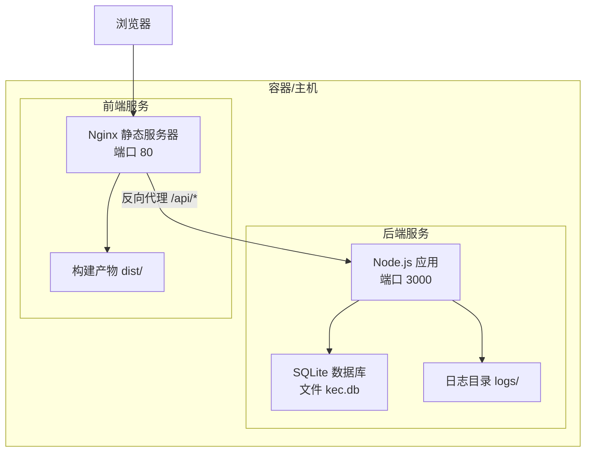
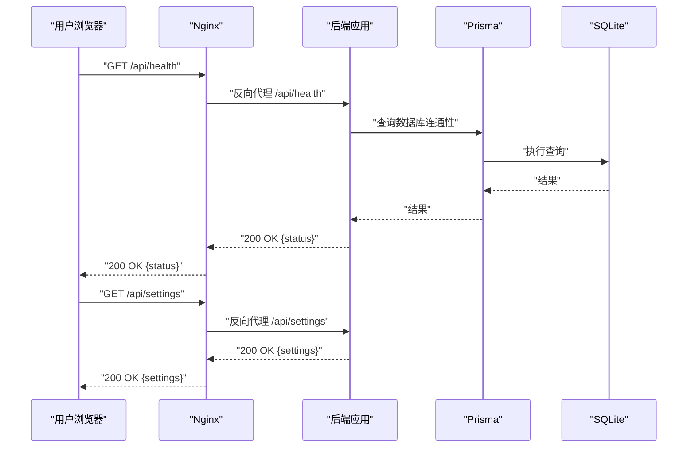
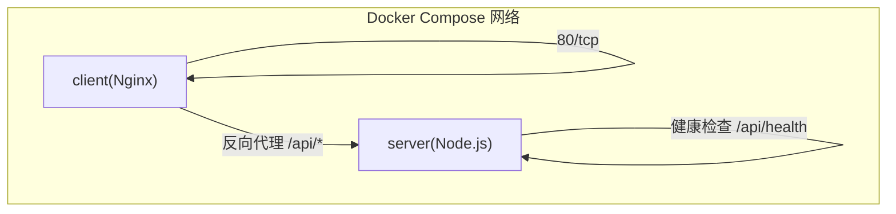
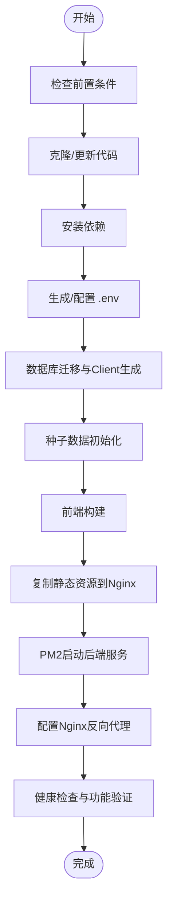
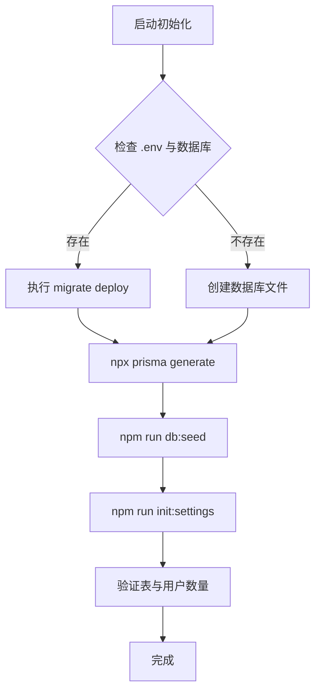
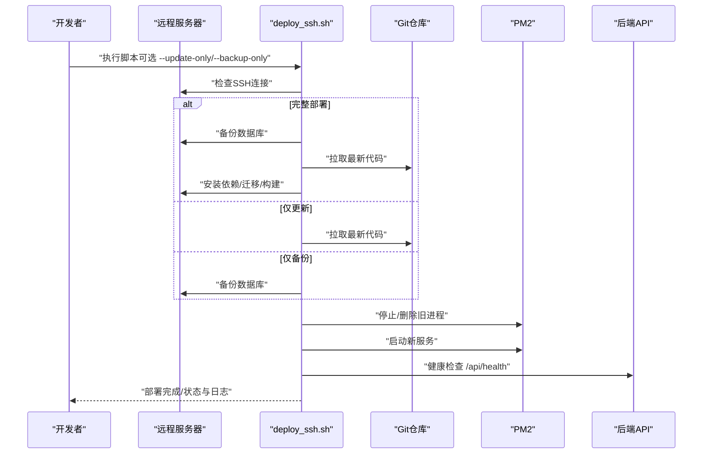
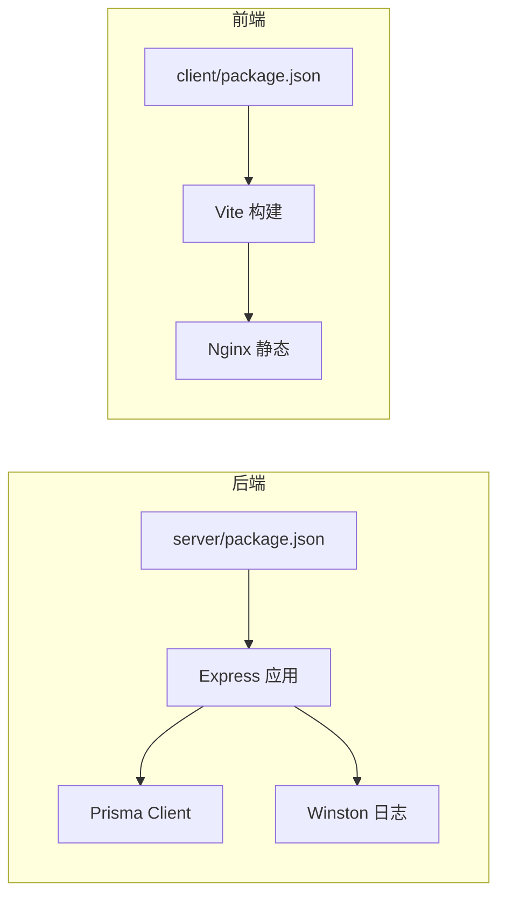

# 部署运维

<cite>
**本文引用的文件**
- [docker-compose.yml](file://docker-compose.yml)
- [deploy.sh](file://deploy.sh)
- [deploy_ssh.sh](file://deploy_ssh.sh)
- [client/nginx.conf](file://client/nginx.conf)
- [client/Dockerfile](file://client/Dockerfile)
- [server/Dockerfile](file://server/Dockerfile)
- [server/package.json](file://server/package.json)
- [client/package.json](file://client/package.json)
- [server/src/app.js](file://server/src/app.js)
- [server/src/server.js](file://server/src/server.js)
- [server/prisma/schema.prisma](file://server/prisma/schema.prisma)
- [docs/PRODUCTION_DEPLOYMENT.md](file://docs/PRODUCTION_DEPLOYMENT.md)
- [server/scripts/init-settings.js](file://server/scripts/init-settings.js)
- [server/scripts/reset-database.js](file://server/scripts/reset-database.js)
- [server/prisma/seed.js](file://server/prisma/seed.js)
- [server/src/utils/logger.js](file://server/src/utils/logger.js)
</cite>

## 目录
1. [简介](#简介)
2. [项目结构](#项目结构)
3. [核心组件](#核心组件)
4. [架构总览](#架构总览)
5. [详细组件分析](#详细组件分析)
6. [依赖分析](#依赖分析)
7. [性能考虑](#性能考虑)
8. [故障排除指南](#故障排除指南)
9. [结论](#结论)
10. [附录](#附录)

## 简介
本指南面向KEC课程管理平台的生产部署与运维，覆盖以下主题：
- Docker Compose容器化部署与裸机部署两种方式的完整流程
- 环境变量配置、数据库初始化、Nginx反向代理配置
- PM2进程管理与健康检查
- 生产环境性能优化（负载均衡、缓存策略、日志与监控）
- 远程部署脚本使用与增量更新策略
- 故障排除与备份恢复方案

## 项目结构
项目采用前后端分离架构，后端基于Node.js + Express + Prisma + SQLite，前端基于Vue 3 + Vite，通过Nginx提供静态资源与API反向代理。

图表来源
- [docker-compose.yml:4-67](file://docker-compose.yml#L4-L67)
- [client/nginx.conf:1-72](file://client/nginx.conf#L1-L72)
- [server/src/app.js:94-113](file://server/src/app.js#L94-L113)
- [server/src/server.js:28-30](file://server/src/server.js#L28-L30)

章节来源
- [docker-compose.yml:1-73](file://docker-compose.yml#L1-L73)
- [client/nginx.conf:1-72](file://client/nginx.conf#L1-L72)
- [server/src/app.js:1-158](file://server/src/app.js#L1-L158)
- [server/src/server.js:1-66](file://server/src/server.js#L1-L66)

## 核心组件
- 后端服务（Node.js + Express）
  - 负责REST API、鉴权、CORS、XSS防护、命名转换、错误处理与健康检查
  - 使用Prisma访问SQLite数据库
- 前端服务（Nginx静态）
  - 提供Vue应用静态资源，代理/api到后端
- 数据库（SQLite）
  - 默认使用文件型数据库，适合中小规模部署
- 运维工具
  - PM2进程管理与开机自启
  - 自动化部署脚本（本地与远程）

章节来源
- [server/src/app.js:1-158](file://server/src/app.js#L1-L158)
- [server/src/server.js:1-66](file://server/src/server.js#L1-L66)
- [server/prisma/schema.prisma:1-308](file://server/prisma/schema.prisma#L1-L308)
- [client/nginx.conf:1-72](file://client/nginx.conf#L1-L72)

## 架构总览
后端通过Nginx对外提供服务，Nginx负责静态资源与API反向代理；后端应用提供健康检查接口与受控的CORS策略，并内置安全头与XSS过滤。

图表来源
- [client/nginx.conf:48-56](file://client/nginx.conf#L48-L56)
- [server/src/app.js:94-113](file://server/src/app.js#L94-L113)
- [server/src/app.js:140-141](file://server/src/app.js#L140-L141)

章节来源
- [client/nginx.conf:1-72](file://client/nginx.conf#L1-L72)
- [server/src/app.js:1-158](file://server/src/app.js#L1-L158)

## 详细组件分析

### Docker Compose 部署（容器化）
- 服务
  - server：Node.js + SQLite，暴露端口3000，挂载数据与上传目录，健康检查
  - client：Nginx，暴露端口80，反向代理/api至server，启用gzip与安全头
- 网络
  - 使用桥接网络，容器间通过服务名通信
- 环境变量
  - 通过环境变量注入JWT密钥、CORS白名单、数据库URL等
- 资源限制
  - 可选CPU与内存限制，便于多应用共存

图表来源
- [docker-compose.yml:4-67](file://docker-compose.yml#L4-L67)
- [client/nginx.conf:48-56](file://client/nginx.conf#L48-L56)

章节来源
- [docker-compose.yml:1-73](file://docker-compose.yml#L1-L73)
- [client/nginx.conf:1-72](file://client/nginx.conf#L1-L72)

### 裸机部署（生产环境）
- 前置条件
  - Node.js 20+、npm、防火墙放行端口3000与80/443
- 步骤
  - 克隆/更新代码、安装依赖（后端生产依赖、前端构建依赖）
  - 生成并配置.env（JWT密钥、数据库URL、CORS、日志级别、文件大小）
  - 数据库迁移与Prisma Client生成、种子数据初始化
  - 前端构建并将dist复制到Nginx目录
  - PM2启动后端服务并设置开机自启
  - 配置Nginx反向代理与安全头
  - 健康检查与功能验证

图表来源
- [docs/PRODUCTION_DEPLOYMENT.md:72-202](file://docs/PRODUCTION_DEPLOYMENT.md#L72-L202)
- [deploy.sh:72-262](file://deploy.sh#L72-L262)

章节来源
- [docs/PRODUCTION_DEPLOYMENT.md:1-341](file://docs/PRODUCTION_DEPLOYMENT.md#L1-L341)
- [deploy.sh:1-262](file://deploy.sh#L1-L262)

### 环境变量配置
- 必填项
  - NODE_ENV、DATABASE_URL、PORT
  - JWT_SECRET、JWT_REFRESH_SECRET、JWT_DOWNLOAD_SECRET
  - CORS_ORIGINS（生产域名）
  - LOG_LEVEL、MAX_FILE_SIZE
- 生成策略
  - 通过脚本生成随机十六进制密钥
  - 仅在.env不存在时生成，避免覆盖

章节来源
- [deploy.sh:102-146](file://deploy.sh#L102-L146)
- [server/src/app.js:42-76](file://server/src/app.js#L42-L76)

### 数据库初始化
- 迁移与Client生成
  - 使用npx prisma migrate deploy与npx prisma generate
- 种子数据
  - 确保超级管理员存在，生产环境保护不被覆盖
  - 可选开发测试数据
- 手动初始化设置
  - 通过脚本初始化系统默认设置（如当前学期、组织名称等）

图表来源
- [deploy.sh:148-175](file://deploy.sh#L148-L175)
- [server/prisma/seed.js:14-51](file://server/prisma/seed.js#L14-L51)
- [server/scripts/init-settings.js:37-78](file://server/scripts/init-settings.js#L37-L78)

章节来源
- [deploy.sh:148-175](file://deploy.sh#L148-L175)
- [server/prisma/seed.js:1-132](file://server/prisma/seed.js#L1-L132)
- [server/scripts/init-settings.js:1-99](file://server/scripts/init-settings.js#L1-L99)

### Nginx 反向代理配置
- 静态资源缓存与gzip压缩
- 安全响应头与CSP策略
- API代理到后端（含X-Real-IP、X-Forwarded-*等头部）
- Vue Router历史模式支持与index.html不缓存

章节来源
- [client/nginx.conf:1-72](file://client/nginx.conf#L1-L72)

### PM2 进程管理
- 安装与启动
  - 全局安装PM2，启动后端服务并命名为kec-server
- 开机自启
  - 保存配置并设置开机自启
- 健康检查
  - 通过curl验证/api/health与/api/settings

章节来源
- [deploy.sh:194-211](file://deploy.sh#L194-L211)
- [deploy_ssh.sh:293-312](file://deploy_ssh.sh#L293-L312)
- [server/src/app.js:94-113](file://server/src/app.js#L94-L113)

### 远程部署脚本与增量更新
- deploy.sh（本地/远程通用）
  - 自动检查Git、Node版本，创建目录，拉取/更新代码，安装依赖，生成.env，数据库迁移与种子数据，前端构建，PM2启动，健康检查
- deploy_ssh.sh（远程专用）
  - 支持三种模式：完整部署、仅更新、仅备份
  - SSH连接检查、备份数据库（保留最近10份）、拉取代码、安装依赖、数据库迁移、前端构建、重启服务、健康检查、状态与磁盘使用情况展示
  - 增量更新：--update-only模式仅更新代码并重启服务，跳过依赖安装与环境配置

图表来源
- [deploy_ssh.sh:404-441](file://deploy_ssh.sh#L404-L441)
- [deploy_ssh.sh:152-185](file://deploy_ssh.sh#L152-L185)
- [deploy_ssh.sh:187-219](file://deploy_ssh.sh#L187-L219)
- [deploy_ssh.sh:221-243](file://deploy_ssh.sh#L221-L243)
- [deploy_ssh.sh:245-276](file://deploy_ssh.sh#L245-L276)
- [deploy_ssh.sh:278-287](file://deploy_ssh.sh#L278-L287)
- [deploy_ssh.sh:289-313](file://deploy_ssh.sh#L289-L313)
- [deploy_ssh.sh:323-346](file://deploy_ssh.sh#L323-L346)

章节来源
- [deploy.sh:1-262](file://deploy.sh#L1-L262)
- [deploy_ssh.sh:1-445](file://deploy_ssh.sh#L1-L445)

## 依赖分析
- 后端依赖
  - Express、Prisma Client、helmet、cors、bcryptjs、multer、winston、jsonwebtoken、rate-limit等
- 前端依赖
  - Vue 3、Element Plus、Axios、Pinia、Vue Router、Vite等
- 构建与运行
  - 后端Dockerfile分阶段构建，生产阶段仅安装运行时依赖并暴露3000端口
  - 前端Dockerfile分阶段构建，生产阶段使用Nginx提供静态服务

图表来源
- [server/package.json:28-52](file://server/package.json#L28-L52)
- [client/package.json:13-32](file://client/package.json#L13-L32)
- [server/Dockerfile:1-46](file://server/Dockerfile#L1-L46)
- [client/Dockerfile:1-30](file://client/Dockerfile#L1-L30)

章节来源
- [server/package.json:1-53](file://server/package.json#L1-L53)
- [client/package.json:1-33](file://client/package.json#L1-L33)
- [server/Dockerfile:1-46](file://server/Dockerfile#L1-L46)
- [client/Dockerfile:1-30](file://client/Dockerfile#L1-L30)

## 性能考虑
- 负载均衡
  - 前端Nginx可作为反向代理层，结合上游多个后端实例实现水平扩展
- 缓存策略
  - 静态资源长期缓存（带哈希文件名），index.html不缓存以保证更新
  - gzip压缩提升传输效率
- 日志管理
  - Winston按级别写入独立文件，生产环境建议配合logrotate进行轮转
- 监控与告警
  - 健康检查接口定期探测，PM2记录进程状态与错误日志
  - 建议接入外部监控（如Prometheus/Grafana或云监控）采集健康检查与日志指标

章节来源
- [client/nginx.conf:7-23](file://client/nginx.conf#L7-L23)
- [client/nginx.conf:34-46](file://client/nginx.conf#L34-L46)
- [server/src/app.js:94-113](file://server/src/app.js#L94-L113)
- [server/src/utils/logger.js:1-96](file://server/src/utils/logger.js#L1-L96)

## 故障排除指南
- 500内部错误
  - 查看PM2日志，常见原因：数据库连接失败、Prisma Client未生成、数据库表缺失
  - 解决：重新生成Prisma Client与迁移，重启服务
- CORS错误
  - 检查.env中CORS_ORIGINS是否包含前端域名，修改后重启服务
- 数据库锁定（SQLite）
  - 检查数据库文件权限，修正属主与权限
- JWT认证失败
  - 检查JWT密钥长度与格式（十六进制字符串）
- 健康检查失败
  - 使用curl验证/api/health与/api/settings，查看PM2日志定位异常

章节来源
- [docs/PRODUCTION_DEPLOYMENT.md:204-250](file://docs/PRODUCTION_DEPLOYMENT.md#L204-L250)
- [server/src/app.js:94-113](file://server/src/app.js#L94-L113)
- [server/src/server.js:10-26](file://server/src/server.js#L10-L26)

## 结论
本指南提供了KEC课程管理平台从容器化到裸机部署的完整运维路径，涵盖环境变量、数据库初始化、Nginx代理、PM2管理、性能优化、远程部署与故障排除。建议在生产环境中优先采用PM2与Nginx组合，并结合自动化脚本与健康检查保障稳定性。

## 附录

### 环境变量清单（摘要）
- NODE_ENV、DATABASE_URL、PORT
- JWT_SECRET、JWT_REFRESH_SECRET、JWT_DOWNLOAD_SECRET
- CORS_ORIGINS、LOG_LEVEL、MAX_FILE_SIZE

章节来源
- [deploy.sh:102-146](file://deploy.sh#L102-L146)
- [server/src/app.js:42-76](file://server/src/app.js#L42-L76)

### 数据库模型要点
- 使用SQLite作为默认存储，支持索引与外键约束
- 关键实体：users、classes、courses、training_plans、teaching_assignments、audit_logs等

章节来源
- [server/prisma/schema.prisma:1-308](file://server/prisma/schema.prisma#L1-L308)

### 备份与恢复
- 备份
  - SQLite：直接复制kec.db文件，保留最近10份
  - MySQL：使用mysqldump生成SQL备份
- 恢复
  - 停止服务，替换数据库文件或导入SQL，重启服务并验证

章节来源
- [deploy_ssh.sh:152-185](file://deploy_ssh.sh#L152-L185)
- [docs/PRODUCTION_DEPLOYMENT.md:273-294](file://docs/PRODUCTION_DEPLOYMENT.md#L273-L294)