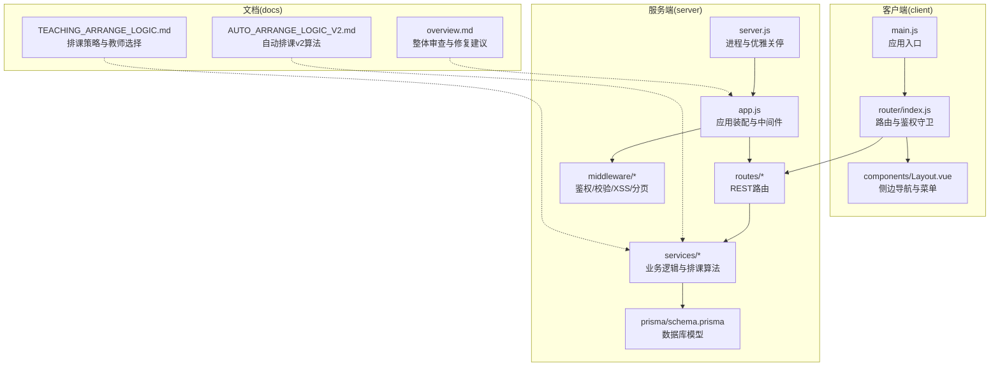
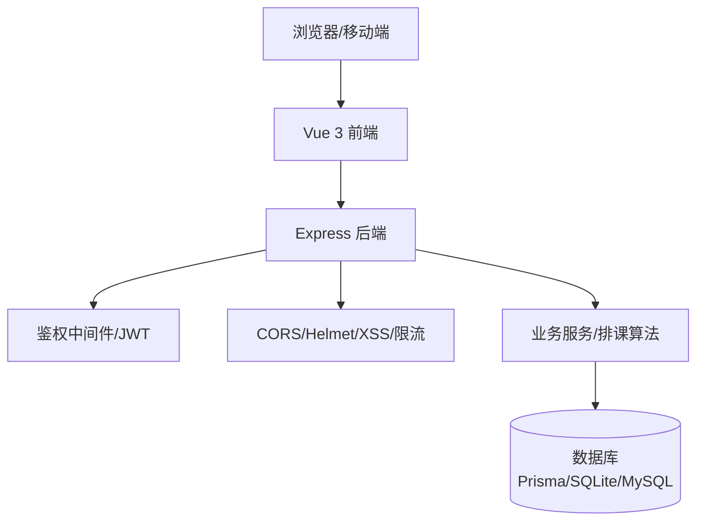
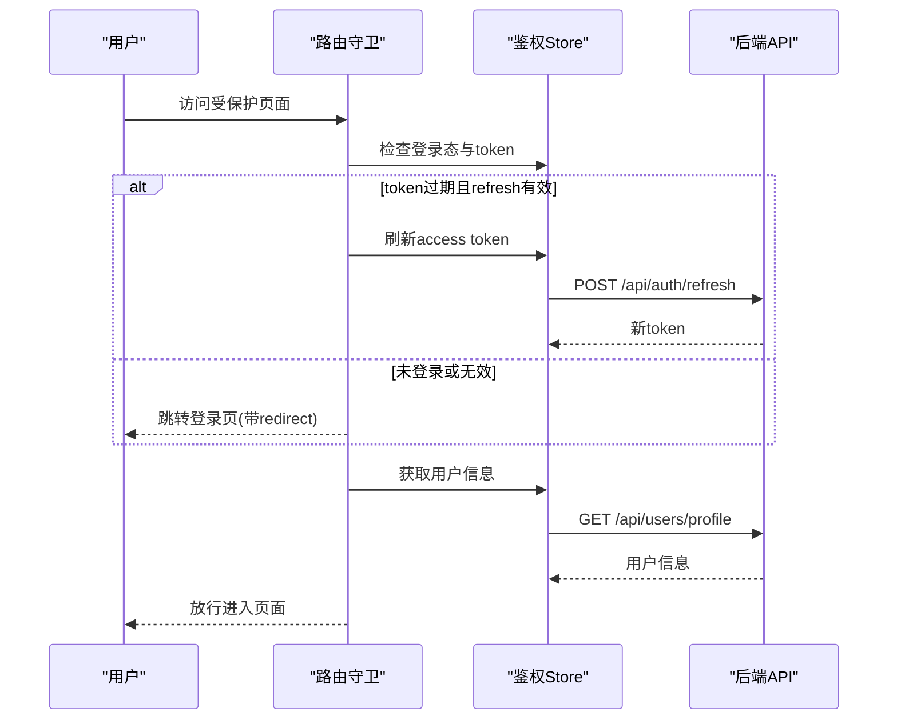
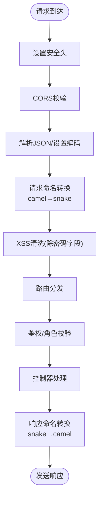
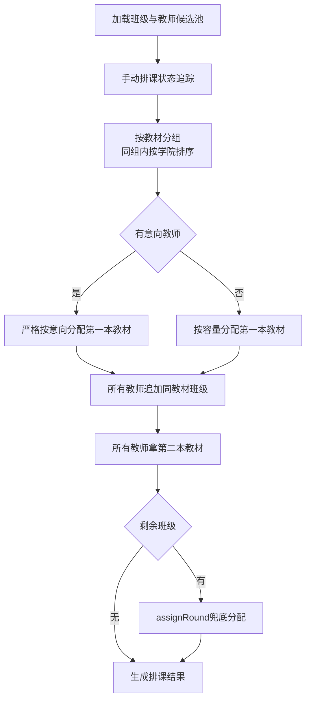
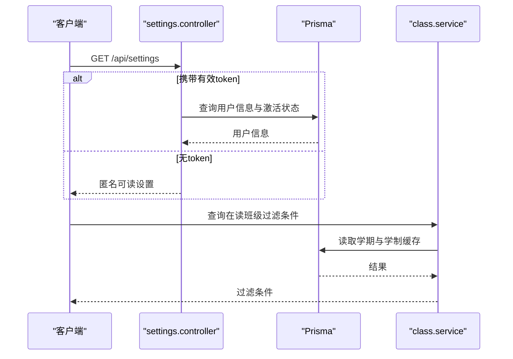
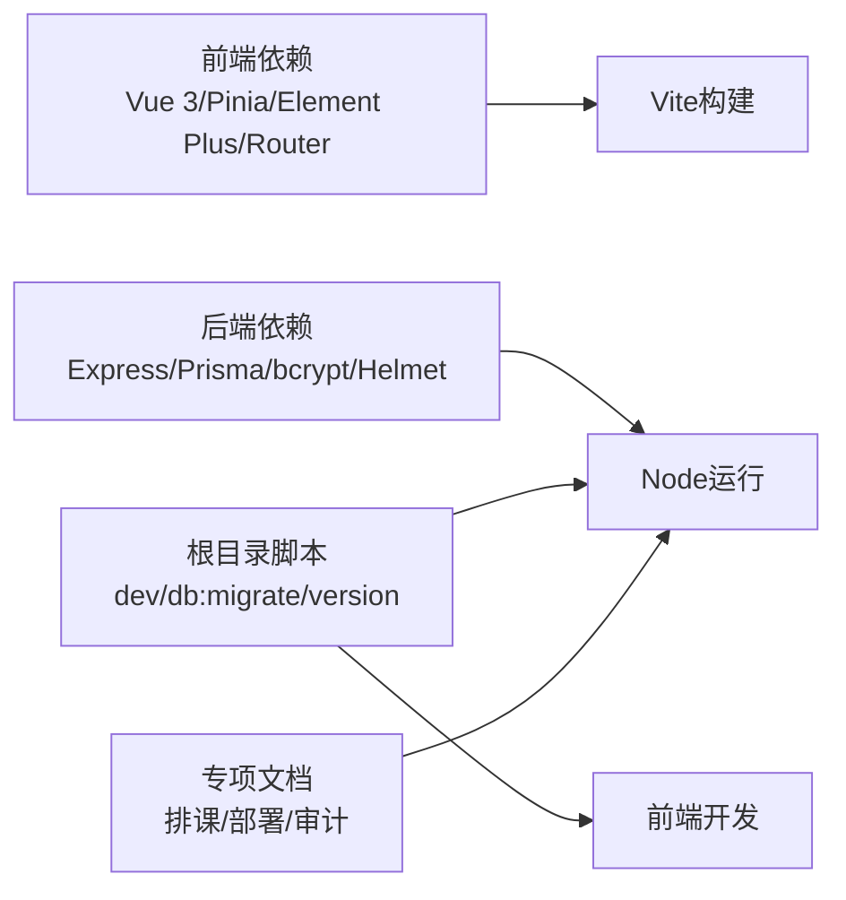

# 项目概述

<cite>
**本文引用的文件**
- [client/package.json](file://client/package.json)
- [server/package.json](file://server/package.json)
- [client/src/main.js](file://client/src/main.js)
- [server/src/app.js](file://server/src/app.js)
- [client/src/router/index.js](file://client/src/router/index.js)
- [client/src/components/Layout.vue](file://client/src/components/Layout.vue)
- [server/src/server.js](file://server/src/server.js)
- [docs/overview.md](file://docs/overview.md)
- [docs/AUTO_ARRANGE_LOGIC_V2.md](file://docs/AUTO_ARRANGE_LOGIC_V2.md)
- [docs/TEACHING_ARRANGE_LOGIC.md](file://docs/TEACHING_ARRANGE_LOGIC.md)
- [server/src/constants/index.js](file://server/src/constants/index.js)
- [server/src/services/class.service.js](file://server/src/services/class.service.js)
- [server/scripts/reset-database.js](file://server/scripts/reset-database.js)
- [package.json](file://package.json)
</cite>

## 目录
1. [引言](#引言)
2. [项目结构](#项目结构)
3. [核心组件](#核心组件)
4. [架构总览](#架构总览)
5. [详细组件分析](#详细组件分析)
6. [依赖关系分析](#依赖关系分析)
7. [性能考量](#性能考量)
8. [故障排查指南](#故障排查指南)
9. [结论](#结论)
10. [附录](#附录)

## 引言
KEC课程管理平台面向中小型教育机构，围绕“培养计划、班级、教师排课、教材协调”等核心教学管理工作，提供前后端分离的现代化解决方案。系统采用Vue 3 + Express.js技术栈，结合Prisma ORM与SQLite/MySQL数据库，支持自动排课算法、导入导出、审计日志与多角色权限控制，旨在提升教学管理效率与数据一致性。

## 项目结构
项目采用前后端分离架构，根目录包含客户端(client)、服务端(server)、文档(docs)与部署脚本。客户端基于Vite构建，服务端基于Express，数据库使用Prisma进行模型管理与迁移。

图表来源
- [client/src/main.js:1-115](file://client/src/main.js#L1-L115)
- [client/src/router/index.js:1-244](file://client/src/router/index.js#L1-L244)
- [client/src/components/Layout.vue:1-63](file://client/src/components/Layout.vue#L1-L63)
- [server/src/app.js:1-158](file://server/src/app.js#L1-L158)
- [server/src/server.js:1-66](file://server/src/server.js#L1-L66)
- [docs/overview.md:1-214](file://docs/overview.md#L1-L214)
- [docs/AUTO_ARRANGE_LOGIC_V2.md:1-632](file://docs/AUTO_ARRANGE_LOGIC_V2.md#L1-L632)
- [docs/TEACHING_ARRANGE_LOGIC.md:201-237](file://docs/TEACHING_ARRANGE_LOGIC.md#L201-L237)

章节来源
- [client/package.json:1-33](file://client/package.json#L1-L33)
- [server/package.json:1-53](file://server/package.json#L1-L53)
- [package.json:1-24](file://package.json#L1-L24)

## 核心组件
- 前端应用
  - 应用入口与插件：创建Vue应用、注册Element Plus、Pinia、路由，全局错误处理与图标按需注册。
  - 路由与权限：基于meta字段的权限控制、登录态与token续签、页面标题设置。
  - 布局与菜单：侧边栏菜单按角色显示，支持折叠与子菜单。
- 后端服务
  - 应用装配：Helmet安全头、CORS白名单、JSON解析、命名转换、XSS清洗、健康检查、路由挂载与错误处理。
  - 进程管理：未捕获异常/拒绝处理、端口占用处理、优雅关停与Prisma断连。
- 业务模块
  - 教学安排：自动排课算法（v2），教材内聚优化，阶段化分配与兜底策略。
  - 基础数据：专业、学院、课程、教材、班级、培养方案。
  - 系统管理：用户管理、系统设置、审计日志、导入导出。
  - 数据服务：在读班级过滤、学期设置、默认课时配置等。

章节来源
- [client/src/main.js:1-115](file://client/src/main.js#L1-L115)
- [client/src/router/index.js:1-244](file://client/src/router/index.js#L1-L244)
- [client/src/components/Layout.vue:1-63](file://client/src/components/Layout.vue#L1-L63)
- [server/src/app.js:1-158](file://server/src/app.js#L1-L158)
- [server/src/server.js:1-66](file://server/src/server.js#L1-L66)
- [docs/AUTO_ARRANGE_LOGIC_V2.md:1-632](file://docs/AUTO_ARRANGE_LOGIC_V2.md#L1-L632)
- [server/src/constants/index.js:55-129](file://server/src/constants/index.js#L55-L129)
- [server/src/services/class.service.js:1-51](file://server/src/services/class.service.js#L1-L51)

## 架构总览
系统采用前后端分离，前端负责UI与交互，后端提供REST API与业务逻辑。核心特性包括：
- 安全与合规：Helmet、CORS白名单、XSS清洗、JWT鉴权、RBAC、审计日志。
- 数据一致性：Prisma事务封装导入、重置、排课等关键流程。
- 可扩展性：模块化路由与中间件、可配置的系统设置与排课参数。

图表来源
- [server/src/app.js:33-89](file://server/src/app.js#L33-L89)
- [server/src/app.js:91-155](file://server/src/app.js#L91-L155)
- [server/src/server.js:10-30](file://server/src/server.js#L10-L30)

## 详细组件分析

### 前端应用与路由
- 应用入口负责全局错误处理、国际化、图标注册与鉴权初始化。
- 路由守卫实现登录态校验、token续签、页面标题与权限拦截。
- 布局组件按角色渲染菜单，支持折叠与子菜单导航。

图表来源
- [client/src/router/index.js:151-241](file://client/src/router/index.js#L151-L241)
- [client/src/main.js:110-115](file://client/src/main.js#L110-L115)

章节来源
- [client/src/main.js:1-115](file://client/src/main.js#L1-L115)
- [client/src/router/index.js:1-244](file://client/src/router/index.js#L1-L244)
- [client/src/components/Layout.vue:1-63](file://client/src/components/Layout.vue#L1-L63)

### 后端应用与中间件
- 安全中间件：Helmet安全头、CORS白名单、XSS清洗、命名转换（camel/snake）、速率限制。
- 路由组织：按模块划分REST路由，公开/私有/管理员/超级管理员权限分级。
- 错误处理：统一错误响应与日志记录，健康检查接口。

图表来源
- [server/src/app.js:33-89](file://server/src/app.js#L33-L89)
- [server/src/app.js:91-155](file://server/src/app.js#L91-L155)

章节来源
- [server/src/app.js:1-158](file://server/src/app.js#L1-L158)

### 自动排课算法（v2）
- 设计理念：教材内聚优先、学院优先、意向约束严格、手动排课追踪、阶段化分配。
- 算法流程：按教材分组、有/无意向教师分阶段分配、追加同教材班级、第二本教材兜底、诊断未分配原因。
- 配置优化：内聚权重、新增教材惩罚、最大教材数限制、阶段链开关等。

图表来源
- [docs/AUTO_ARRANGE_LOGIC_V2.md:35-104](file://docs/AUTO_ARRANGE_LOGIC_V2.md#L35-L104)
- [docs/AUTO_ARRANGE_LOGIC_V2.md:164-283](file://docs/AUTO_ARRANGE_LOGIC_V2.md#L164-L283)
- [docs/TEACHING_ARRANGE_LOGIC.md:221-237](file://docs/TEACHING_ARRANGE_LOGIC.md#L221-L237)

章节来源
- [docs/AUTO_ARRANGE_LOGIC_V2.md:1-632](file://docs/AUTO_ARRANGE_LOGIC_V2.md#L1-L632)
- [docs/TEACHING_ARRANGE_LOGIC.md:201-237](file://docs/TEACHING_ARRANGE_LOGIC.md#L201-L237)
- [server/src/constants/index.js:87-112](file://server/src/constants/index.js#L87-L112)

### 数据服务与系统设置
- 在读班级过滤：基于当前学期与学制年限动态构建WHERE条件，带缓存与失效。
- 系统设置：提供默认设置、当前学期、组织名称等，支持匿名访问与鉴权区分。
- 数据重置：一键重置数据库并初始化默认用户与系统设置。

图表来源
- [server/src/controllers/settings.controller.js:15-29](file://server/src/controllers/settings.controller.js#L15-L29)
- [server/src/services/class.service.js:23-51](file://server/src/services/class.service.js#L23-L51)

章节来源
- [server/src/services/class.service.js:1-51](file://server/src/services/class.service.js#L1-L51)
- [server/scripts/reset-database.js:1-130](file://server/scripts/reset-database.js#L1-L130)

## 依赖关系分析
- 技术栈
  - 前端：Vue 3、Pinia、Element Plus、Vue Router、Axios、Vite。
  - 后端：Express、Prisma、bcrypt、helmet、cors、express-validator、winston、exceljs、multer。
- 项目脚本：根目录提供并行启动前后端、数据库迁移与版本管理脚本。
- 文档与规范：包含部署、性能诊断、排课算法优化、导出导入审计等专项文档。

图表来源
- [client/package.json:13-31](file://client/package.json#L13-L31)
- [server/package.json:28-51](file://server/package.json#L28-L51)
- [package.json:7-16](file://package.json#L7-L16)

章节来源
- [client/package.json:1-33](file://client/package.json#L1-L33)
- [server/package.json:1-53](file://server/package.json#L1-L53)
- [package.json:1-24](file://package.json#L1-L24)

## 性能考量
- 前端
  - 图标按需注册减少体积；全局错误与警告处理避免应用崩溃。
  - 路由守卫与鉴权Store减少无效请求。
- 后端
  - 命名转换与XSS清洗在中间件层集中处理，避免路由重复实现。
  - 健康检查与日志记录便于运维监控。
- 算法与数据
  - 排课阶段化与兜底策略提升分配率；在读班级过滤与缓存降低查询成本。
  - 导入流程使用事务保证一致性，待后续优化N+1问题。

## 故障排查指南
- 常见问题与修复
  - 密码字段被XSS清洗导致无法登录：已在中间件中加入跳过白名单。
  - 分页上限缺失引发OOM：已强制分页上限。
  - 重置接口无速率限制：已增加限流。
  - 事务内级联删除未包裹事务：已修复为事务包裹。
- 运维要点
  - 未捕获异常/拒绝：进程退出并记录日志，确保可观测性。
  - 端口占用：检测并提示关闭占用进程。
  - 优雅关停：关闭HTTP服务并断开数据库连接，超时强制退出。

章节来源
- [docs/overview.md:104-133](file://docs/overview.md#L104-L133)
- [docs/overview.md:159-214](file://docs/overview.md#L159-L214)
- [server/src/server.js:10-40](file://server/src/server.js#L10-L40)

## 结论
KEC课程管理平台通过前后端分离与模块化设计，结合完善的鉴权、审计与排课算法，为中小型教育机构提供了稳定、可扩展的教学管理解决方案。项目在安全性、一致性与可维护性方面持续改进，具备良好的演进基础。

## 附录
- 应用背景与价值主张
  - 服务于中小规模教学单位，覆盖培养计划、班级、教师排课、教材协调等核心场景。
  - 通过自动化与可视化工具降低人工成本，提升排课质量与数据透明度。
- 技术选型优势
  - Vue 3：组件化与Composition API提升开发体验；配合Element Plus与Pinia形成高效生态。
  - Express：简洁灵活，中间件体系完善；结合Prisma实现ORM与事务一致性。
  - 文档与规范：专项文档支撑算法优化与部署运维，保障项目可持续发展。